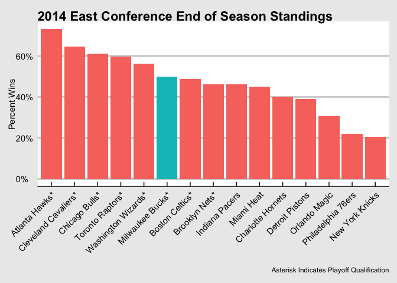
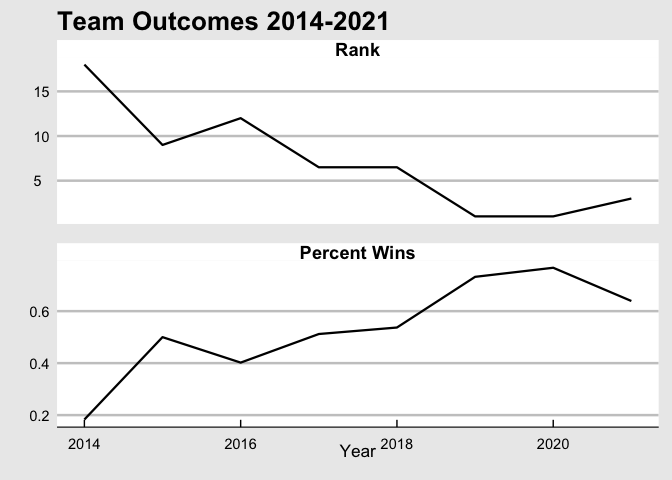
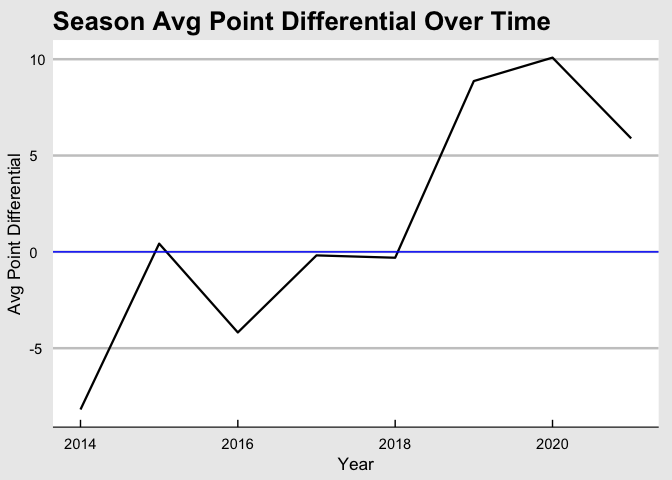
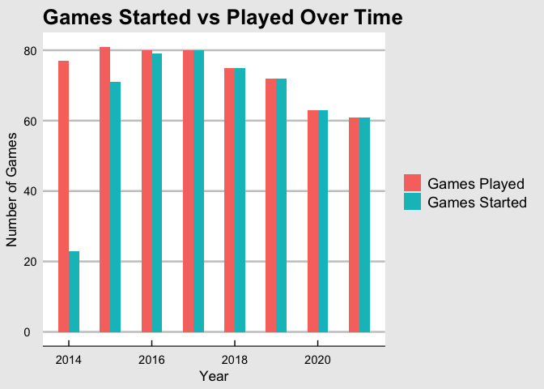
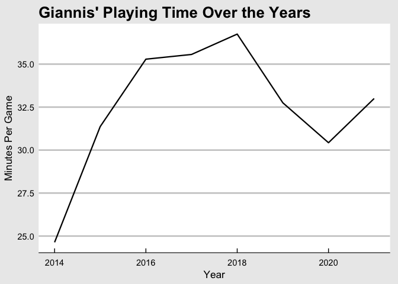
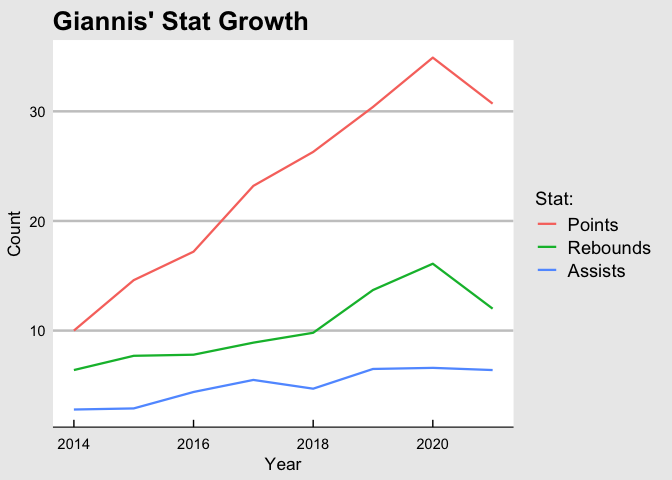

Giannis Antetokounmpo and the Milwaukee Bucks
================
Joey Cipriano

-   [The Rise of the Bucks](#the-rise-of-the-bucks)
-   [The Rise of Giannis](#the-rise-of-giannis)
-   [Conclusion](#conclusion)

Giannis Antetokounmpo just won his first ever NBA Championship with the
Milwaukee Bucks, who haven’t won a championship in nearly half a
century. In order to celebrate, let’s take a deeper dive into his career
thus far and the path him and the Bucks took to get to this day. All
data sourced from
[Basketball-Reference.com](https://www.basketball-reference.com/) and
retrieved using their API.

## The Rise of the Bucks

The Bucks were not a pretty mediocre team when they drafted Giannis 15th
in the 2013 NBA draft.

Even though they were the 6th seed, they were bounced in the first round
[in 6 games by the Chicago
Bulls](https://www.landofbasketball.com/yearbyyear/2014_2015_playoffs_brackets.htm).
After Giannis was drafted, things did not necessarily get better right
away. In fact, they got much, much worse. In Giannis’ rookie year, the
Bucks were 18th in the Eastern Conference. But the good thing about Rock
BottomTM, is that there’s only up to go from there.

As you can see, in the 8 years since the Bucks drafter Giannis, the
Bucks have gotten consistently better in both end of season standing and
win percentage. All of this ultimately culminated in a championship this
year! Note: For 2019 and 2020, the bucks have been the team with the
most wins at the end of the regular season in the Eastern Conference,
making them the favorites to win the Eastern Conference Championship. It
took years of getting bounced from the playoffs earlier than expected
for them to get the pieces right in order to make it to the end and win
it all.

Below, I’ve charted the change in their average point differential over
time. This number represents the average difference in their team’s
score and their opponents at the end of any given game. This stat is
valuable because it not only shows us how much the Bucks have been
winning, but just how much have they been winning by.

Again, we see a steady rise over time. At their peak in 2020, the Bucks
were being teams by an average of 10 points a game!

All of that success doesn’t come out of nowhere. There is one man who is
to blame for the meteoric rise of the Bucks…

## The Rise of Giannis

In terms of career arcs, Giannis has had one of the best in NBA history.
He wasn’t a star out of the gate like many superstars before him such as
Michael Jordan or Shaq (who Giannis has drawn many comparisons to).
After being drafted 15th, Giannis didn’t even start that many games in
his first season, and remember, this was on a team that was so bad they
only won 20% of their games.

And to Giannis’ credit, playing in the NBA was very different than the
Greek league that he was used to. On top of that, he was only 19 years
old! As he got older and more experienced he would start playing more
and more minutes as the team began to lean on him for his sccoring
prowess as well as his imposing defense.

You can see here that Giannis was playing over 35 minutes a game near
the end of 2010’s. This curtailed as he bloomed into a full time star,
likely as the result of minutes limiting injuries as well as more of a
focus on maintaining his body instead of feeling compelled to prove
himself.

Now that we have an idea of how much his playing time has changed, let’s
look at the stats that earned him all those minutes in the first place.
Giannis has become a volume scorer in the last 5 years, which has a lot
to do with his improved strength allowing him to get to the hoop
whenever he wants.

Giannis has become a more and more productive player over the years,
consistently raising his stats in key areas.

## Conclusion

Giannis has finally led the Bucks to a championship. It might have
seemed like an impossibility back in 2014, but through hard work and
consistent growth, as well as a contribution from teammates, coaching
staff and the front office that can’t be ignored. Congrats to the city
of Milwaukee, the Bucks and all their fans!
